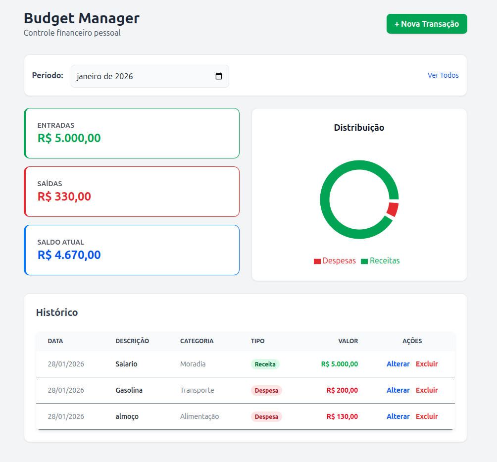

# Budget Manager


> A full-stack financial control application designed to simplify personal expense tracking through a clean UI and a robust RESTful API.

---

### Live Demo

| Frontend (Vercel) | Backend Docs (Swagger) |
| :---: | :---: |
| [**Click to Access App**](https://budget-manager-puce.vercel.app) | [**View API Documentation**](https://budgetmanager-jzu5.onrender.com/docs) |

---

## Preview



---

## Tech Stack

### Backend
* **Language:** Python 3
* **Framework:** FastAPI (High performance, easy to learn, fast to code, ready for production)
* **Database:** PostgreSQL (Production on Render) / SQLite (Local Development)
* **ORM:** SQLAlchemy (for database interactions)
* **Dependency Manager:** Poetry
* **Validation:** Pydantic

### Frontend
* **Library:** React.js
* **Build Tool:** Vite (Super fast build times)
* **Styling:** Tailwind CSS (Utility-first CSS framework)
* **HTTP Client:** Axios

### DevOps & Deployment
* **Backend Hosting:** Render
* **Frontend Hosting:** Vercel
* **CI/CD:** Automatic deployment via Git push
* **Version Control:** Git & GitHub (using Conventional Commits)

---

## Key Features

* **RESTful API:** Fully documented endpoints using OpenAPI (Swagger UI).
* **Hybrid Database System:** Intelligently switches between SQLite for local development and PostgreSQL for production using Environment Variables.
* **CRUD Operations:** Create, Read, Update, and Delete transactions easily.
* **Filtering:** Filter transactions by date range and specific categories.
* **Responsive Design:** Works seamlessly on desktop and mobile devices.

---

## How to Run Locally

If you want to clone and run this project on your machine, follow these steps:

### Prerequisites
* Python 3.10+
* Node.js & npm
* Poetry (Python package manager)

### 1. Backend Setup

```bash
# Clone the repository
git clone [https://github.com/pablomigueldias/BudgetManager](https://github.com/pablomigueldias/BudgetManager)
cd budget-manager/backend

# Install dependencies with Poetry
poetry install

# Activate virtual environment
poetry shell

# Run the server
uvicorn app.main:app --reload
```

### 2. Frontend Setup

```bash
# Open a new terminal and navigate to frontend folder
cd ../frontend

# Install dependencies
npm install

# Run the project
npm run dev
```

## Engineering Decisions

Why FastAPI? Chosen for its speed (Starlette) and automatic data validation (Pydantic). It allows for rapid development of robust APIs with auto-generated documentation.

Database Strategy (Environment Parity) To ensure a smooth developer experience (DX) without sacrificing production stability, the application uses a dynamic database connection string. It defaults to a lightweight SQLite file locally but automatically connects to PostgreSQL when it detects the DATABASE_URL environment variable in the Render cloud environment.

---

## Contact
Pablo Miguel Dias Ortiz Fullstack Developer & Data Science